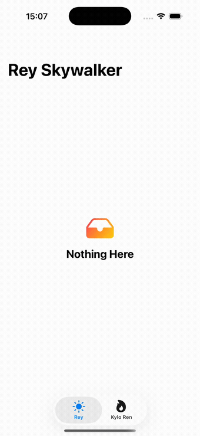

# ScreenStates

[](https://swift.org)
[](#requirements)
[](https://swift.org/package-manager/)
[](LICENSE)
[](https://marinazvyagina.github.io/ScreenStates/documentation/screenstates/)

Every screen that loads data has the same four states: **Empty**, **Loading**, **Data**, and **Error**. ScreenStates gives you one small, dependency-free type — `ScreenState<Value>` — to model that, plus ready-to-use SwiftUI and UIKit views that render it, so you stop rebuilding the same `if/else` ladder in every screen.

- 🔹 One generic enum for all four states, usable in any screen, any paradigm
- 🔹 Built on the **Observation** framework (`@Observable`) — no Combine, no third-party dependencies
- 🔹 Works with **SwiftUI** (`ScreenStateView`) and **UIKit** (`ScreenStateContainerView`) from the same store
- 🔹 Sensible default placeholders (built on `ContentUnavailableView` / `UIActivityIndicatorView`) that you can fully replace
- 🔹 Tested with **Swift Testing**, built with **Swift 6** strict concurrency

<p align="center">
  
</p>

<p align="center"><em>The <a href="Demo/ScreenStatesDemo">demo app</a> — one SwiftUI screen, one UIKit screen, both auto-cycling through all four states.</em></p>

## Requirements

- iOS 17.0+
- Swift 6.0 / Xcode 16+

## Installation — Swift Package Manager

**In Xcode:** File → Add Package Dependencies… → enter the repository URL → select the `ScreenStates` product → Add Package.

**In `Package.swift`:**

```swift
dependencies: [
    .package(url: "https://github.com/<your-account>/ScreenStates.git", from: "1.0.0")
],
targets: [
    .target(
        name: "YourApp",
        dependencies: ["ScreenStates"]
    )
]
```

Then, in any file:

```swift
import ScreenStates
```

## The core type

```swift
public enum ScreenState<Value> {
    case empty
    case loading
    case data(Value)
    case error(Error)
}
```

Drive it with `ScreenStateStore`, an `@Observable` class that owns the state and knows how to run an async load:

```swift
let store = ScreenStateStore<[Article]>()

await store.load {
    try await api.fetchArticles()
}
// store.state is now .data([...]) or .error(...)
```

If `Value` is a `Collection` (an array, for example), use `loadCollection(_:)` instead — an empty result is mapped to `.empty` automatically:

```swift
await store.loadCollection {
    try await api.fetchArticles() // [] → .empty, otherwise → .data
}
```

You can also drive the state manually with `setLoading()`, `setEmpty()`, `setData(_:)`, and `setError(_:)`.

## How a screen was opened

`ScreenState` only models what a screen is showing right now. `ScreenOpenSource` is a separate, independent type for *how the screen came to be visible* — freshly pushed, popped back to, presented modally, deep-linked, or opened from a Home Screen shortcut — so a screen can change its behavior accordingly (e.g. skip a reload when merely returning to it):

```swift
public enum ScreenOpenSource<Screen> {
    case push(from: Screen)
    case pop(from: Screen)
    case presented(from: Screen)
    case deepLink(URL)
    case shortcut(id: String)
    case tabSelection
    case unknown
}
```

ScreenStates can't detect this on its own — pass it in wherever your app already knows the answer (a coordinator, a router, a `NavigationStack` path change, `onOpenURL`, a shortcut-item handler):

```swift
func onAppear(source: ScreenOpenSource<AppScreen>) {
    if source.isPop {
        return // already have data from before — nothing to do
    }
    Task { await store.loadCollection { try await api.fetchArticles() } }
}
```

## Quick start — SwiftUI

```swift
import SwiftUI
import ScreenStates

struct ArticlesScreen: View {
    @State private var store = ScreenStateStore<[Article]>()

    var body: some View {
        ScreenStateView(store.state, onRetry: reload) { articles in
            List(articles) { article in
                Text(article.title)
            }
        }
        .task { await reload() }
    }

    private func reload() async {
        await store.loadCollection { try await api.fetchArticles() }
    }
}
```

That's it: `ScreenStateView` shows the default Loading spinner, Empty placeholder, or Error view (with a working Retry button) automatically, and your `content` closure only ever runs for the `.data` case.

### Custom Empty / Loading / Error views

```swift
ScreenStateView(store.state) { articles in
    ArticleList(articles)
} empty: {
    ContentUnavailableView("No Articles Yet", systemImage: "newspaper")
} loading: {
    ProgressView("Loading articles…")
} error: { error in
    MyErrorBanner(error: error, retry: reload)
}
```

## Quick start — UIKit

```swift
import UIKit
import ScreenStates

final class ArticlesViewController: UIViewController {
    private let store = ScreenStateStore<[Article]>()
    private lazy var container = ScreenStateContainerView<[Article]>(onRetry: { [weak self] in
        Task { await self?.reload() }
    }) { articles in
        let list = ArticleListView(articles: articles) // any UIView you build from `articles`
        return list
    }

    override func viewDidLoad() {
        super.viewDidLoad()
        container.translatesAutoresizingMaskIntoConstraints = false
        view.addSubview(container)
        NSLayoutConstraint.activate([
            container.topAnchor.constraint(equalTo: view.topAnchor),
            container.bottomAnchor.constraint(equalTo: view.bottomAnchor),
            container.leadingAnchor.constraint(equalTo: view.leadingAnchor),
            container.trailingAnchor.constraint(equalTo: view.trailingAnchor)
        ])
        container.bind(to: store) // keeps container.state in sync with store.state

        Task { await reload() }
    }

    private func reload() async {
        await store.loadCollection { try await api.fetchArticles() }
    }
}
```

`bind(to:)` uses `withObservationTracking` under the hood — the same Observation framework mechanism SwiftUI itself relies on — so `ScreenStateContainerView` re-renders automatically whenever `store.state` changes, with no Combine, delegates, or NotificationCenter involved.

### Custom Empty / Loading / Error views

```swift
ScreenStateContainerView<[Article]>(
    emptyView: MyEmptyView(),
    loadingView: MyLoadingView(),
    errorView: { error in MyErrorView(error: error) },
    content: { articles in ArticleListView(articles: articles) }
)
```

## Demo app

[`Demo/ScreenStatesDemo`](Demo/ScreenStatesDemo) is a runnable two-screen app —
one SwiftUI screen (Rey Skywalker), one UIKit screen (Kylo Ren) — that
auto-cycles through all four states every couple of seconds using the
library's real API. Open `Demo/ScreenStatesDemo/ScreenStatesDemo.xcodeproj`
and run it.

## Documentation

Full API reference and getting-started guides for both paradigms are published at
**[marinazvyagina.github.io/ScreenStates](https://marinazvyagina.github.io/ScreenStates/documentation/screenstates/)**,
generated with DocC. It's regenerated with [`Scripts/generate-docs.sh`](Scripts/generate-docs.sh).

## API reference

| Type | Purpose |
|---|---|
| `ScreenState<Value>` | `.empty`, `.loading`, `.data(Value)`, `.error(Error)`, plus `value`, `error`, `isLoading`, `isEmpty` helpers |
| `ScreenStateStore<Value>` | `@Observable` container: `state`, `load(_:)`, `loadCollection(_:)` (when `Value: Collection`), `setLoading()`, `setEmpty()`, `setData(_:)`, `setError(_:)` |
| `ScreenStateView<Value, Content>` | SwiftUI container that switches on a `ScreenState` |
| `ScreenStateContainerView<Value>` | UIKit `UIView` container that switches on a `ScreenState`; `bind(to:)` syncs it to a store |
| `ScreenStateDefault{Empty,Loading,Error}View` | Default SwiftUI placeholders |
| `ScreenStateDefault{Empty,Loading,Error}UIView` | Default UIKit placeholders |
| `ScreenOpenSource<Screen>` | `.push`/`.pop`/`.presented(from:)`, `.deepLink(URL)`, `.shortcut(id:)`, `.tabSelection`, `.unknown`, plus `isPop`, `originatingScreen` helpers |

## License

Released under the [MIT License](LICENSE).
